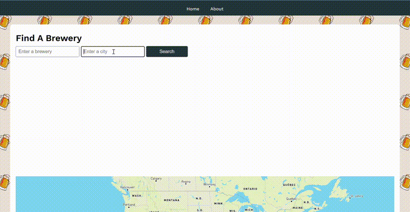
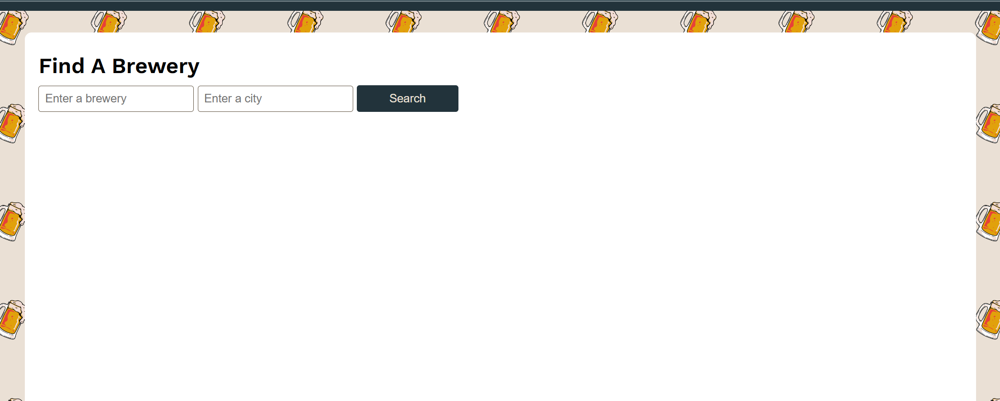
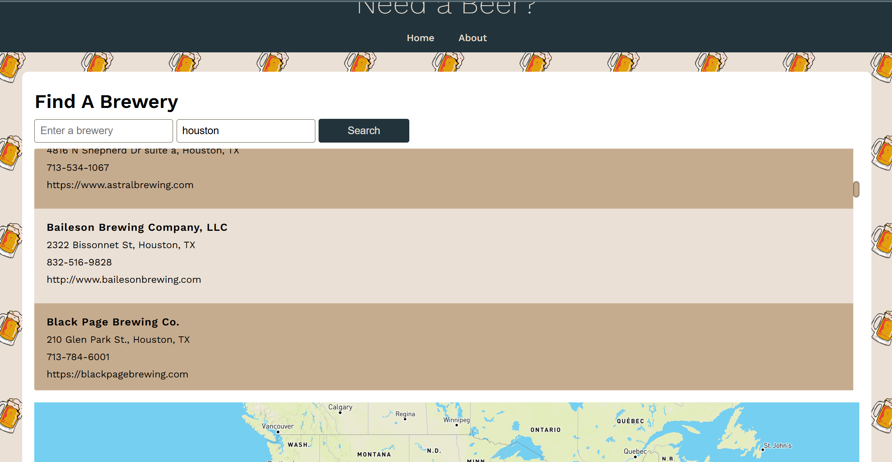
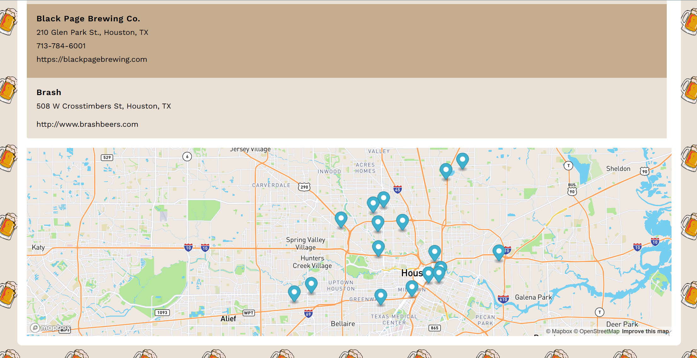

# BreweryFinder 🍻🍻

#### Table Of Contents
[Description](#description)  
[Links](#links)  
[How To Get Started](#how-to-get-started)  
[Screenshots/Demo](#screenshotsdemo)

## Description
Ever wonder what it would be like to find where the breweries are in the palm of your hand ❓ With Brewery Finder, you are able to find your local breweries and save them just like that. If you know the name of the place you want to go to, start with a search. 🌆 If you're new or don't even know the name of the brewery, use a city search to find the local one's near you!

## Links

<a href="https://chriscondreay.github.io/BreweryFinder/" target="_blank">🍺 **Brewery Finder** 🍺</a>

<a href="https://github.com/chriscondreay/BreweryFinder">🔧 **Github Repo** 🔧</a>

## How To Get Started
Here's how to get started. Click the url link above OR clone the repository and run **index.html**. To get started, just simply search the name of a city that you reside in or are visiting into the search bar. Optionally, if you know the name of the brewery already you can enter the name and search this way. You can then click search and a list of breweries with the map location and basic information will show on the page.

## Screenshots/Demo

## Coming Soon
Coming Soon - Drink Saver